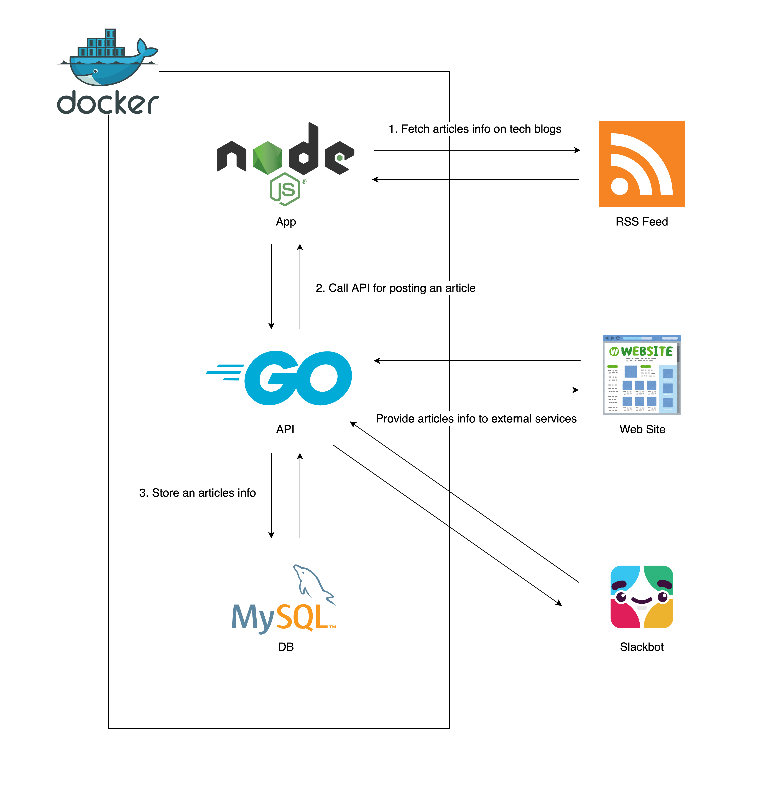

# Spider
Spider is an app which collects tech news from RSS feeds.

## :deciduous_tree: Project Structure
* API
  * Get articles info from Database
  * Post an article info to Database
* App
  * Collect articles info on tech blogs and post it through the API
* Database
  * Store articles info

## :computer: Technology Stack
* Go 1.12
* Node.js 10
* MySQL 5.7
* Docker



<div>Icons made by <a href="https://www.freepik.com/" title="Freepik">Freepik</a> from <a href="https://www.flaticon.com/" 			    title="Flaticon">www.flaticon.com</a> is licensed by <a href="http://creativecommons.org/licenses/by/3.0/" 			    title="Creative Commons BY 3.0" >CC 3.0 BY</a></div>

## :wrench: Configure
Add db environment variables to `api/.env`.

```
DB_HOST=db
DB_PORT=3306
DB_NAME=spiderdb
DB_USER=
DB_PASSWORD=
DB_CHARSET=utf8mb4
```

Add feed URLs subject to collect article info to `app/config/default.json`.

```json
{
  "feedUrls": [
    "https://blog.kentarom.com/rss.xml"
  ]
}
```

## :floppy_disk: Install and Run
```bash
$ cd app
$ npm install
$ cd ../
$ docker-compose up
```

## :arrow_forward: Usage

### Collect articles info and Post it
```
$ curl http://localhost:3000/add
```

### Get articles
```
$ curl "http://localhost:8080/articles?since=2019-03-17T19:00:51Z&sort=desc&limit=2"
```

Please read to the following documents for API parameters.
[http://localhost:8080/swagger/index.html](http://localhost:8080/swagger/index.html)

## :memo: LICENSE
MIT
